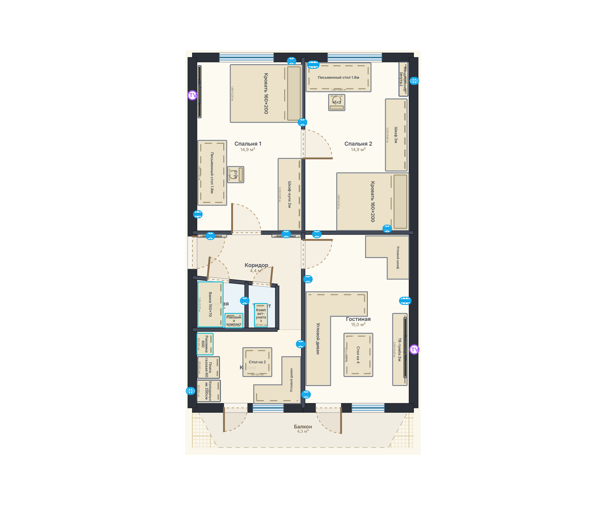
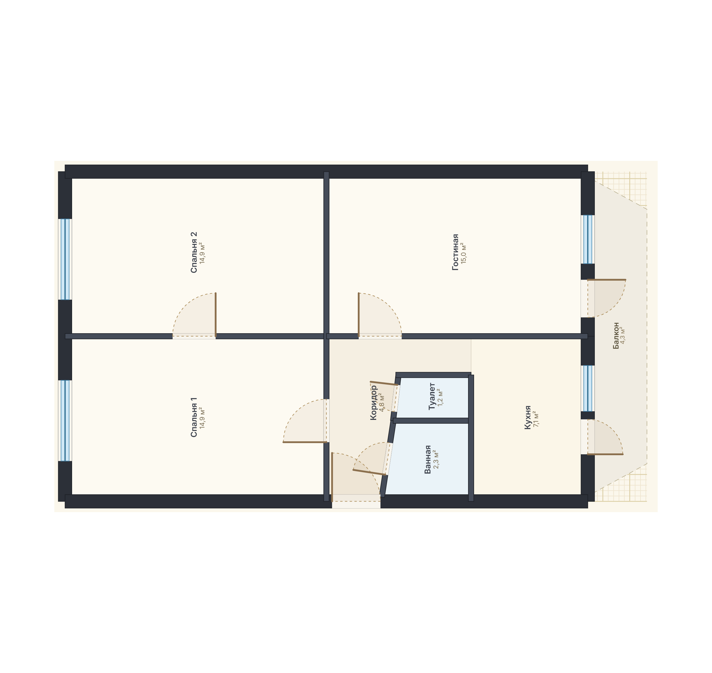
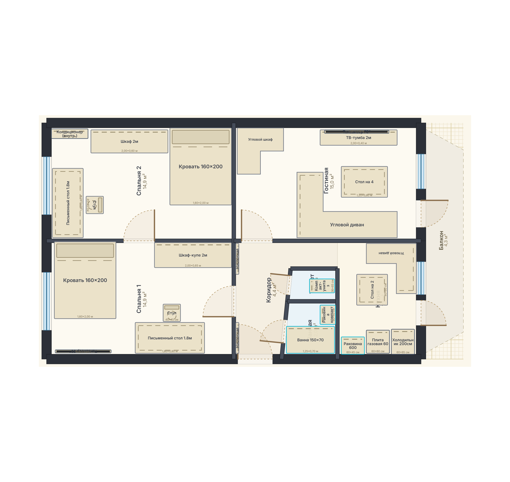
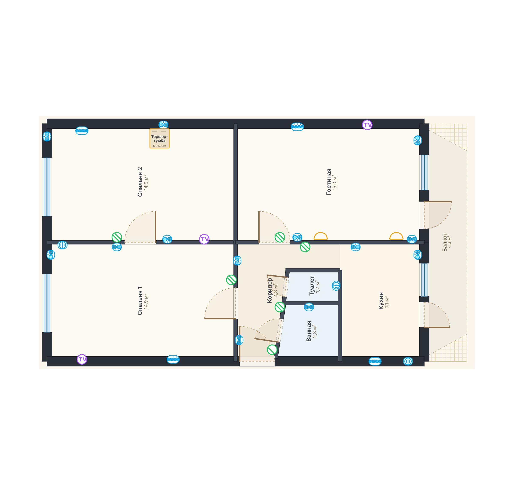
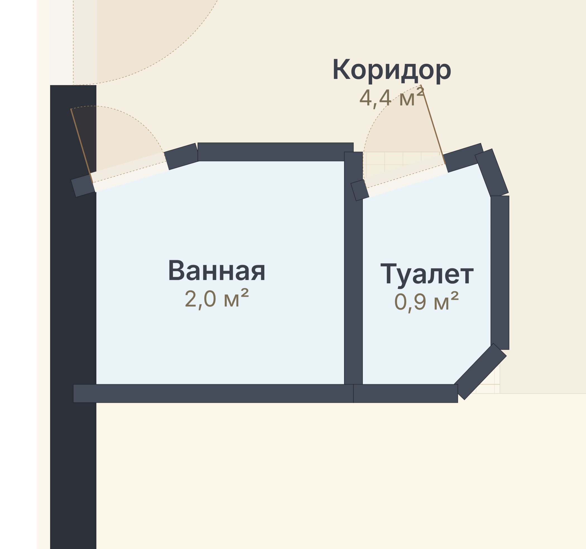
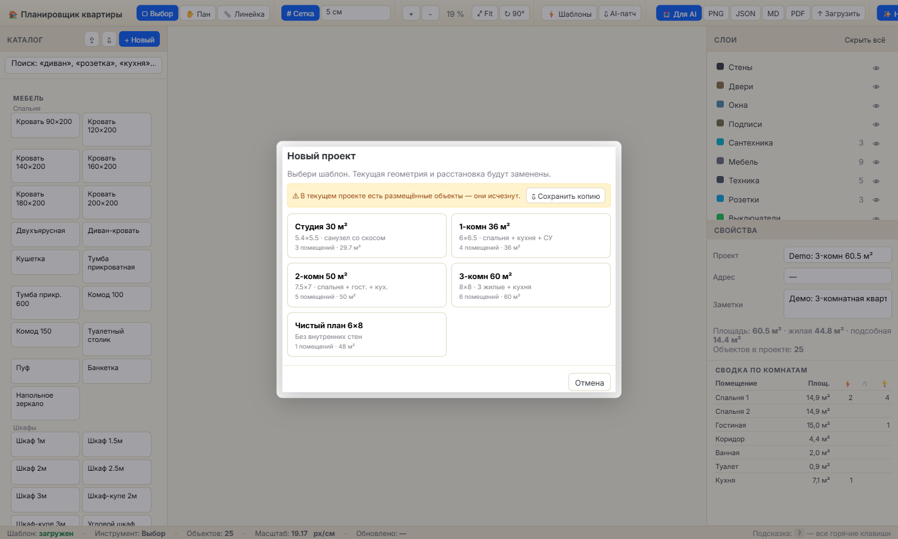
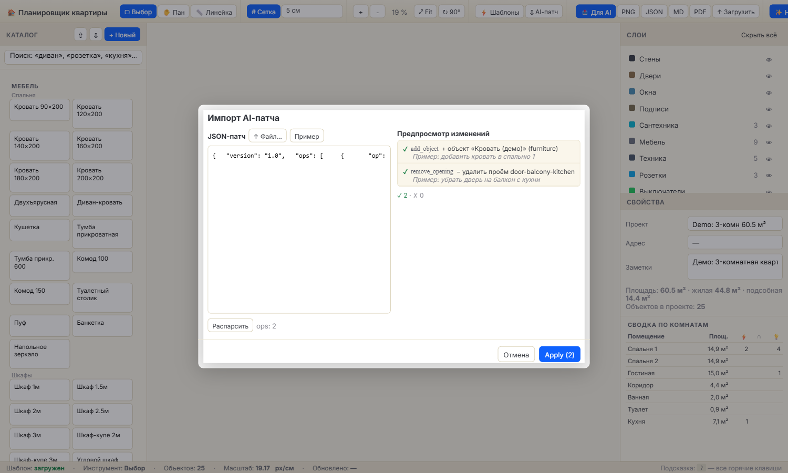
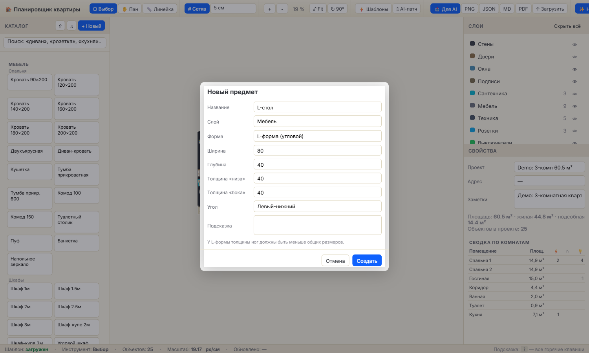

# Flat Planner

Веб-планировщик квартиры на React + Konva. Делает то, что нужно для **реального ремонта**: точная геометрия по БТИ, расстановка мебели/техники/сантехники, **полный электрический проект** (розетки, выключатели, свет, слаботочка), экспорт для строителей и для AI-моделей.

> Простой, локальный, бесплатный, без регистрации. Всё в браузере. Автосохранение в localStorage, перенос — через `project.json`.



---

## ✨ Что внутри

### Геометрия
- 🏠 **Точная геометрия БТИ** — стены, скосы, ниши, окна, двери с правильными дугами открывания на любых стенах (включая диагональные)
- ✏️ **Конструктор плана прямо в браузере** — кнопка «➕ Пустой план N×M» создаёт коробку, потом инструменты **🧱 Стена** (клик-клик, Shift — цепочка), **🏠 Комната** (полигон с замыканием), **🚪 Дверь** и **🪟 Окно** (клик возле стены — проём встаёт на ось стены). Стены и комнаты выделяются левым кликом и **тянутся за маркеры на концах / вершинах** для правки геометрии (с привязкой к сетке). Лишнее удаляется `Del`, любое действие откатывается `Ctrl+Z`
- 🆕 **Шаблоны квартир** — встроенные (студия / 1-2-3 комн / blank), **свои в localStorage**, импорт/экспорт через JSON
- ↻ **Поворот всего плана** на 90°/180°/270°
- ⚙ **Единое меню «Настройки»** — кнопка в правом краю тулбара. Внутри: сетка + привязка (0 / 1 / 5 / 10 / 20 см), сброс расстановки, перечитать `project.json`, показать обучение снова. Текущий шаг привязки виден на самой кнопке (`⚙ 5 см ▾`)

### Расстановка
- 🛋 **265+ позиций каталога** — мебель, техника (Bosch, Tion и др.), сантехника, светильники, кондиционеры, бризеры
- 🛏️ **Кровати-трансформеры** — Murphy bed вертикальная (1700×2200/450), горизонтальная (2200×1700/450), кровать-шкаф со шкафным фасадом (1800×2200/600), диван-кровать еврокнижка (2000×2000/950). Кнопка «⬇ Разложить / ⬆ Сложить» в Свойствах меняет габариты, корпус остаётся «приклеен» к стене (математика поворота учитывается). Размеры взяты из реальных каталогов
- 🚿 **Раковина-стиралка** — комбо для маленьких санузлов (500×500 / 600×600): снизу стиралка, сверху плоская раковина с кран-моноблоком и сливом
- ⚡ **Электрика** — розетки 220V и 32A, IP44 для влажных зон, выключатели (одно-/двух-/трёхклавишные, проходные, диммеры), свет (потолочные/споты/трек/LED/бра/торшеры/IP44 для ванной), слаботочка (RJ45, ТВ, антенна, HDMI). **Розетки**: одинарная / двойная / тройная / блок 4 — корпус разной длины с N гнёздами внутри. **Выключатели**: 1кл / 2кл / 3кл — N параллельных рычажков, проходной получает шеврон ↗ в конце рычажка. Видно с одного взгляда без надписей
- 🧩 **Свои предметы** — конструктор форм: прямоугольник, круг, **L-форма** (4 ориентации с настраиваемыми ногами), **произвольный полигон**
- 🧲 **Wall-mounted** — ТВ/кондиционеры/бризеры/полотенцесушители при размещении автоматически прилипают к ближайшей стене
- 🎯 **Visual rotate handle** на канвасе для одиночно выбранного объекта (snap 15°, Shift — свободно)
- 🚪🪟 **Редактирование проёмов** прямо на холсте — клик по двери/окну → справа панель «Свойства проёма»: тип (дверь / окно), ширина, сдвиг от точки `a`, открывание (left/right/sliding/none), сторона петель (in/out), для окна — высота и подоконник. `Del` удаляет
- 🏠 **Редактирование комнат** — клик по полигону комнаты → справа правка названия, типа (жилая / кухня / ванная / туалет / коридор / балкон), площади и заметок. Полигон тащится за маркеры на вершинах
- 📍 **Подписи внутри L-форм** — для углового дивана и углового шкафа метки автоматически размещаются в более «жирном» плече L, не вылезают в пустой угол bbox

### Работа с проектом
- ↶ **Undo / Redo** — `Ctrl+Z` и `Ctrl+Shift+Z` (история на 50 шагов: расстановка, рисование, удаление, импорт)
- 💾 **Автосохранение в localStorage** каждые 1.5 секунды — индикатор «✓ Сохранено · ЧЧ:ММ:СС» в статус-баре
- 🔗 **Поделиться ссылкой** — кнопка «🔗 Поделиться» в тулбаре кодирует текущий проект (gzip + base64url) в URL-фрагмент. Кидаешь ссылку — получатель открывает свой план без файлов, без сервера
- 📱 **Mobile read-only** — на телефоне/планшете (или узком окне < 820 px) автоматически включается режим просмотра: только тулбар + холст с pan/zoom/fit + слой PNG-экспорта. Прячутся каталог и боковые панели, чтобы не мешали смотреть план в дороге
- 👋 **Туториал** при первом заходе — короткие 5 шагов с обзором кнопок. Кнопка **«Пропустить обучение»** видна сразу. Перезапустить — из справки `?` → «↻ Показать обучение снова»
- 🔀 **Изменяемая правая панель** — перетащи разделитель между «Слои» и «Свойства», поменяй их местами кнопкой ⇅ или разверни одну на всю высоту (▲ / ▼). Состояние запоминается в localStorage
- 👁 **12 слоёв** — стены, двери, окна, подписи, мебель, техника, сантехника, розетки, выключатели, свет, слаботочка, заметки — каждый скрывается отдельно
- 📐 **Линейка** с фиксацией: 1-й клик — старт, 2-й — фиксация (зелёная сплошная линия с расстоянием), 3-й — новое измерение. Esc — отмена

### Интеграция с AI и экспорт
- 📷 **Импорт скана БТИ через AI** — кнопка **«📷 БТИ→AI»** даёт готовый промпт. Копируешь его в Claude / ChatGPT-4o / Qwen-VL / Gemini, прикрепляешь фото или скан плана, модель возвращает JSON в формате ProjectData. Вставляешь обратно в это же окно — план готов, ничего вручную не обводишь.
- 🤖 **AI-патчи** — отправляешь архив (план + JSON + Markdown) в **любую мультимодальную LLM** (Claude / ChatGPT / Qwen / Gemini / Llama-Vision …), получаешь JSON-патч с правками, приложение показывает diff и применяет одним кликом
- 🖼 **Экспорт**: ZIP с timestamp, PNG, PDF (A3 ландшафт), JSON, Markdown с таблицами по комнатам
- 🇷🇺 Размеры внутри в **миллиметрах** (стандарт стройки), в UI — в **см / м** (понятно)

## 🎨 Один проект — три проекции

Один и тот же `project.json`, но **слои показываем по очереди**: чистая архитектура для согласования планировки, потом мебель — для эргономики, потом электрика — для электрика-монтажника. Никаких отдельных файлов: одно нажатие в панели «Слои» — и план превращается в нужный чертёж.

<table>
<tr>
<td align="center" width="33%"><b>🏗 Архитектура</b><br/><sub>стены · двери · окна · подписи</sub></td>
<td align="center" width="33%"><b>🛋 + Мебель</b><br/><sub>+ техника · сантехника</sub></td>
<td align="center" width="33%"><b>⚡ + Электрика</b><br/><sub>+ розетки · выключатели · ТВ · LAN</sub></td>
</tr>
<tr>
<td></td>
<td></td>
<td></td>
</tr>
</table>

<details>
<summary><b>Детали интерфейса</b> — узлы и диалоги</summary>

| | |
|---|---|
| **Узел санузла** со скошенной фасадной стеной — двери ванной и туалета на диагональной стенке открываются правильными дугами |  |
| **«✨ Новый проект»** — выбор шаблона квартиры одной кнопкой |  |
| **«⇩ AI-патч»** — вставляешь JSON от любой LLM, видишь diff построчно, применяешь по кнопке Apply |  |
| **«+ Новый»** — конструктор пользовательских предметов: прямоугольник / круг / L-форма / произвольный полигон |  |

</details>

## 🚀 Быстрый старт

```bash
git clone https://github.com/Ko-nD/flat-planner.git
cd flat-planner
npm install
npm run dev
```

Откроется http://localhost:5180

## 📋 Workflow

1. **Возьми готовый шаблон или нарисуй свой** — кнопка **«✨ Новый проект»**:
   - **Создать с нуля**: вводишь ширину и высоту (в метрах) → жмёшь «Создать» → получаешь пустую коробку. Дальше включаешь **🧱 Стена** и **🏠 Комната** в тулбаре и расставляешь геометрию мышью прямо на холсте. Лишние стены/комнаты — клик и `Del`. Любое неудачное действие — `Ctrl+Z`.
   - **Встроенные**: студия / 1-2-3 комн / blank — типовая БТИ-геометрия одной кнопкой.
   - **Мои шаблоны**: свои планы хранятся в localStorage. «💾 Сохранить текущий» фиксирует план, «⇩ JSON» рядом с карточкой — экспорт. «⇩ Импорт JSON» принимает чужой ProjectData (если кто-то прислал).
   - Альтернативы: открыть `public/project.json` и подставить геометрию руками или нажать **«↑ Загрузить»** для готового JSON.
2. **Расставь мебель и электрику** — клик по предмету в каталоге → клик на план. Можно сразу применять **готовые шаблоны** электрики (кровать с розетками и бра, ТВ-зона, кухонный блок и т.д.). Свойства выбранного объекта — в правой панели; перетащи разделитель, чтобы дать «Слоям» больше места или наоборот.
3. **Получи правки от AI** — нажми **«📤 Для AI»**, кинь ZIP в любой чат с моделью с поддержкой изображений (Claude, ChatGPT, Qwen, Gemini …) и попроси «найди ошибки в эргономике и розетках».
4. **Примени патч** — **«⇩ AI-патч»** → вставь JSON → увидишь превью изменений → **Apply** (любые правки можно откатить через `Ctrl+Z`).
5. **Отдай строителю** — экспорт **PDF** или **Markdown** со всеми координатами в см.

> **Где хранятся чертежи?** В `localStorage` браузера — автосохранение каждые 1.5 секунды (см. индикатор «✓ Сохранено» в нижнем статус-баре). Кнопка **JSON** в тулбаре — экспорт снапшота для бэкапа или переноса на другое устройство.

## 🧠 Совместимые AI-модели

Любая мультимодальная LLM, которая принимает картинки и возвращает текст:

| Модель | Где | Заметки |
|---|---|---|
| **Anthropic Claude** (Opus / Sonnet) | claude.ai | хорошо понимает архитектурные планы и JSON-схемы |
| **OpenAI GPT-4o / o1** | chat.openai.com | возвращает JSON по запросу, надёжно |
| **Qwen-VL** (`qwen2-vl-72b`, `qwen-vl-max`) | chat.qwen.ai / API | отличный анализ изображений, бесплатный лимит |
| **Google Gemini** (Pro / Flash) | gemini.google.com | большое контекстное окно для длинных проектов |
| **Llama-Vision** / **Mistral Pixtral** | self-hosted, OpenRouter | для офлайн-работы |

Внутри ZIP-пакета (кнопка **«📤 Для AI»**) лежит готовый промпт в `apartment-brief.md` — просто скопируй его в чат и приложи три файла.

## 📁 Формат `project.json`

```json
{
  "version": "1.0",
  "meta": { "name": "Моя квартира", "totalArea": 60.5, "livingArea": 44.8, "auxArea": 14.4 },
  "geometry": {
    "bounds": { "width": 6130, "height": 10820 },
    "rooms": [
      { "id": "r1", "name": "Спальня 1", "kind": "living", "area": 14.9,
        "polygon": [{"x":0,"y":0},{"x":3070,"y":0},{"x":3070,"y":4860},{"x":0,"y":4860}] }
    ],
    "walls": [
      { "id": "ext-n", "a": {"x":0,"y":0}, "b": {"x":6130,"y":0}, "thickness": 250, "external": true }
    ],
    "openings": [
      { "id": "win-r1", "kind": "window", "wallId": "ext-n",
        "offset": 1500, "width": 1500, "sillHeight": 850, "height": 1500 }
    ]
  },
  "objects": [
    { "id": "abc", "catalogId": "bed-160", "layer": "furniture",
      "x": 1500, "y": 2400, "rotation": 0, "width": 1600, "depth": 2000 }
  ],
  "layerVisibility": { "walls": true, "doors": true }
}
```

Все размеры — в **миллиметрах**. Координаты от внутреннего верхнего-левого угла квартиры.

## 🤖 Формат AI-патча

```json
{
  "version": "1.0",
  "ops": [
    { "op": "move_object", "id": "abc", "x": 1800, "y": 2400, "reason": "перенести кровать к стене" },
    { "op": "add_object", "object": {
      "id": "new1", "catalogId": "socket-2", "layer": "sockets",
      "x": 1700, "y": 2200, "rotation": 0, "width": 160, "depth": 80, "mountHeight": 300
    } },
    { "op": "remove_opening", "id": "door-balcony-kitchen" },
    { "op": "replace_room_polygon", "id": "bath", "polygon": [] },
    { "op": "remove_wall", "id": "w-old" }
  ]
}
```

Поддерживаемые операции:

- **Объекты**: `add_object` · `update_object` · `move_object` · `delete_object`
- **Помещения**: `add_room` · `update_room` · `replace_room_polygon` · `remove_room`
- **Стены**: `add_wall` · `replace_wall` · `remove_wall` (заодно убирает все openings на этой стене)
- **Проёмы**: `add_opening` · `update_opening` · `remove_opening`

Каждая операция принимает опциональное поле `reason` — оно показывается в превью. Сломанные операции пропускаются при Apply, успешные — применяются.

Готовый промпт лежит в `apartment-brief.md` внутри ZIP-пакета — просто перешли пакет любой AI-модели и попроси «верни JSON-патч».

## ⌨️ Горячие клавиши

| Клавиша | Действие |
|---|---|
| Колесо мыши | Зум относительно курсора |
| `Space` + drag · средняя кнопка | Рука (двигать вид) |
| `V` / `H` / `M` | Выбор / Рука / Линейка |
| `M` (1-й клик) | Поставить первую точку линейки |
| `M` (2-й клик) | Зафиксировать вторую точку (зелёная сплошная линия) |
| `M` (3-й клик) | Начать новое измерение |
| `G` | Сетка вкл/выкл |
| `R` / `Shift+R` | Поворот ±15° |
| `Del` / `Backspace` | Удалить выделенный объект **или стену / комнату** |
| `Ctrl+D` | Дублировать |
| **`Ctrl+Z`** | Отменить последнее действие |
| **`Ctrl+Shift+Z`** или **`Ctrl+Y`** | Повторить отменённое |
| `Esc` | Снять выделение / выйти из placement / отменить недорисованную стену или комнату |
| `Shift` при клике-размещении | Не выходить из режима — ставить много подряд |
| `Shift` в режиме 🧱 Стена | Цепочка стен от последней точки |
| `Enter` в режиме 🏠 Комната | Замкнуть полигон (то же — клик в первую точку или правый клик) |

Полный список и пояснения — кнопка `?` в правой части тулбара.

## 🛠 Стек

- React 19 + TypeScript + Vite
- [Konva](https://konvajs.org) (`react-konva`) для канваса
- [Zustand](https://zustand.docs.pmnd.rs/) для состояния
- [JSZip](https://stuk.github.io/jszip/) для пакета «Для AI»
- [jsPDF](https://github.com/parallax/jsPDF) + html2canvas для PDF

## 🔧 Разработка

```bash
npm run dev      # дев-сервер на 5180 с HMR
npm run build    # production build
npm run preview  # просмотр прод-версии
```

Структура:

```
src/
├── data/apartment.ts          # fallback-импорт public/project.json
├── catalog/
│   ├── catalog.ts             # 265+ позиций каталога
│   └── templates.ts           # готовые шаблоны электрики
├── templates/
│   ├── flatTemplates.ts       # 5 встроенных шаблонов квартир для «Новый проект»
│   ├── userFlatTemplates.ts   # CRUD пользовательских шаблонов в localStorage + парсер JSON
│   └── blankPlan.ts           # параметризованная пустая коробка W×H для конструктора
├── store/projectStore.ts      # zustand: state + persistence + bootstrap fetch
├── utils/
│   ├── geometry.ts            # nearestWall, openingSegment, polygonArea...
│   ├── format.ts              # mm ↔ см ↔ м, парсинг ввода
│   ├── patch.ts               # AI-патч: parse/preview/apply
│   └── export.ts              # PNG / PDF / Markdown / ZIP
├── components/
│   ├── Canvas/                # PlanCanvas, Walls, Openings, Rooms, ObjectShape, RotateHandle...
│   └── Layout/                # Toolbar, Library, SidePanels (LayersPanel + Properties с splitter), Statusbar, PatchDialog
└── types/index.ts             # все типы
```

`public/project.json` — единственный источник истины для геометрии. После правки — кнопка **«↻ Шаблон»** или `localStorage.removeItem('flat-planner-project-v2')` + reload.

## 🔒 Личная работа без коммитов

Если ты форкнул репо чтобы спланировать **свою** квартиру, а демо в `public/project.json` хочешь оставить как есть для других — есть два способа.

**Способ 1: localStorage (рекомендую)**
Просто работай в UI. Всё автосохраняется в браузере. В репо ничего не уходит. Скачивай бэкапы через **JSON** в Toolbar и клади в локальную папку `private/` — она в `.gitignore`.

**Способ 2: skip-worktree (если редактируешь `public/project.json` напрямую)**
После первого коммита заморозь файл локально:

```bash
git update-index --skip-worktree public/project.json
```

Теперь твои локальные правки этого файла Git **не видит** — `git status` молчит, push ничего не отправляет. В репо демо остаётся стабильным.

Чтобы потом подтянуть обновления из main:
```bash
git update-index --no-skip-worktree public/project.json
git pull
git update-index --skip-worktree public/project.json
```

Откатить весь skip-worktree:
```bash
git update-index --no-skip-worktree public/project.json
```

## 🤝 Contributing

PR-ы приветствуются. Перед коммитом проверь:

```bash
npx tsc --noEmit
npm run build
```

## 📝 License

MIT — см. [LICENSE](LICENSE)

---

Сделано для своих ремонтов и проектов перепланировки. Если пригодилось — поставь ⭐ и форкни под свою квартиру.
